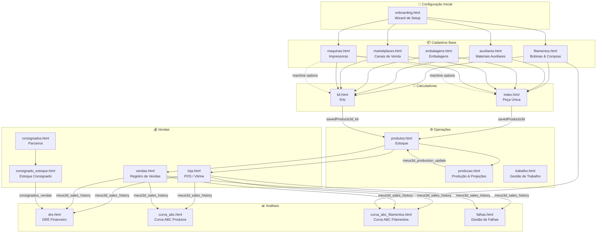

# 📊 Relatório Completo do Sistema — Meus 3D

> Sistema completo de gestão para negócios de impressão 3D, cobrindo desde o cadastro de matéria-prima até o DRE financeiro.

---

## 1. Visão Geral & Stack Tecnológico

**Meus 3D** é uma aplicação web completa, 100% client-side, projetada para makers e negócios de impressão 3D. Cobre toda a operação ponta a ponta:

| Área | Funcionalidades |
|:--|:--|
| **Matéria-prima** | Filamentos, materiais auxiliares, embalagens |
| **Máquinas** | Frota de impressoras, manutenção, payback |
| **Precificação** | Calculadoras (peça única e kits) |
| **Produção** | Planejamento, capacidade, projeções |
| **Estoque** | Controle de produtos acabados |
| **Vendas** | POS (loja), registro manual, canais de venda |
| **Consignação** | Parceiros, estoque consignado, vendas |
| **Financeiro** | DRE, Curva ABC, gestão de falhas, trabalho |

### Stack Técnico

- **Frontend**: HTML5 + CSS3 (Custom Properties, Design Tokens) + JavaScript ES6+ (Vanilla)
- **Armazenamento**: `localStorage` do navegador (zero backend/servidor)
- **Bibliotecas**:
  - **Chart.js** (v4.4.x) — gráficos interativos
  - **jsPDF + jsPDF-AutoTable** — geração de orçamentos em PDF
  - **Google Fonts** — Inter, DM Sans, JetBrains Mono
- **Design**: Tema dark/light, glassmorfismo, gradientes animados, micro-animações

---

## 2. Design System & Tema

O sistema usa um design system tokenizado definido em [`style.css`](file:///c:/Users/thiag/Downloads/Meus%203D/style.css):

| Token | Cor | Uso |
|:--|:--|:--|
| Primary Gradient | `#6366f1 → #a855f7` | Botões, cabeçalhos |
| Success/Lucro | `#22c55e` / `#34d399` | Indicadores positivos |
| Warning/Operacional | `#f59e0b` / `#f97316` | Alertas, custos |
| Danger/Perda | `#ef4444` / `#f87171` | Falhas, prejuízo |
| Accent Cyan | `#06b6d4` | Destaques |

- **Temas**: Dark (padrão) e Light via `[data-theme]`
- **Glassmorfismo**: Cards com `backdrop-filter: blur()`, bordas translúcidas
- **Animações**: Orbs flutuantes no background (`.bg-animation`)

### Módulos Compartilhados

| Arquivo | Função |
|:--|:--|
| [`shared.js`](file:///c:/Users/thiag/Downloads/Meus%203D/shared.js) | Menu drawer global, toggle de tema, redirecionamento onboarding, toast notifications |
| [`calculator-core.js`](file:///c:/Users/thiag/Downloads/Meus%203D/calculator-core.js) | Geração dinâmica de inputs de filamento multicor, cálculos compartilhados |

---

## 3. Páginas do Sistema — Detalhamento Completo

---

### 🧮 `index.html` — Calculadora de Precificação (Peça Única)

[Abrir arquivo](file:///c:/Users/thiag/Downloads/Meus%203D/index.html) · Script: [`script.js`](file:///c:/Users/thiag/Downloads/Meus%203D/script.js)

**Propósito**: Calculadora principal para precificação de produtos impressos em 3D (peça individual).

**Funcionalidades**:
- Cálculo multi-filamento (peso em gramas, custo/kg salvo ou manual)
- Adição de materiais auxiliares (parafusos, imãs, insertos)
- Tempo de impressão (horas + minutos), quantidade, potência da impressora, custo kWh
- Custos operacionais: embalagem, pós-processamento, design/modelagem, outros custos
- Métricas financeiras: taxa de falha %, margem de lucro %, impostos %, taxa marketplace
- Cálculo em tempo real: custo de produção, breakdown por unidade, preço sugerido, lucro líquido, ROI
- Salvar produto no catálogo
- Geração de orçamento em PDF

**localStorage**:
- **Lê**: `meus3d_filaments`, `meus3d_aux_inventory_v1`, `meus3d_packaging_v1`, `meus3d_marketplaces`, `meus3d_machines`, `meus3d_defaults`
- **Grava**: `savedProducts3d`, `meus3d_defaults`

---

### 📦 `kit.html` — Calculadora de Kits

[Abrir arquivo](file:///c:/Users/thiag/Downloads/Meus%203D/kit.html) · Script: [`script-kit.js`](file:///c:/Users/thiag/Downloads/Meus%203D/script-kit.js)

**Propósito**: Calculadora adaptada para kits com múltiplas peças (ex: jogo de 4 porta-copos).

**Diferenças do `index.html`**:
- Campo **"Peças por Kit"** (`piecesPerKit`)
- Campo de quantidade = **quantidade de kits** (não de peças)
- Calcula consumo de material e tempo de impressão por kit completo
- Salva em chave separada (`savedProducts3d_kit`) com flag `_type: 'kit'`

**localStorage**:
- **Lê**: mesmos do `index.html`
- **Grava**: `savedProducts3d_kit`, `meus3d_defaults`

---

### 🎨 `filamentos.html` — Cadastro de Filamentos

[Abrir arquivo](file:///c:/Users/thiag/Downloads/Meus%203D/filamentos.html) · Script: [`script-filamentos.js`](file:///c:/Users/thiag/Downloads/Meus%203D/script-filamentos.js)

**Propósito**: Gerenciar estoque de bobinas, marcas, materiais, cores e histórico de compras.

**Funcionalidades**:
- Cadastro de bobina: Marca, Material (PLA/ABS/PETG/TPU/Resina), Cor (nome + hex picker), Peso da bobina (g)
- Modal de registro de compras → rastreia custo total por kg
- Abas: Estoque (cards), Histórico de Compras, Top 50 Filamentos Comprados

**localStorage**: `meus3d_filaments`

---

### 🔩 `auxiliares.html` — Materiais Auxiliares

[Abrir arquivo](file:///c:/Users/thiag/Downloads/Meus%203D/auxiliares.html) · Script: [`script-auxiliares.js`](file:///c:/Users/thiag/Downloads/Meus%203D/script-auxiliares.js)

**Propósito**: Estoque de peças não-impressas (imãs, chaveiros, parafusos, cola, rolamentos).

**Funcionalidades**:
- KPI: Itens Únicos, Volume Total, Capital Investido
- Registro de compras (data, quantidade, custo total, custo unitário)
- Tabela com estoque, custo médio unitário, valor retido

**localStorage**: `meus3d_aux_inventory_v1`

---

### 📦 `embalagens.html` — Embalagens

[Abrir arquivo](file:///c:/Users/thiag/Downloads/Meus%203D/embalagens.html) · Script: [`script-embalagens.js`](file:///c:/Users/thiag/Downloads/Meus%203D/script-embalagens.js)

**Propósito**: Gerenciar estoque de caixas, envelopes, plástico bolha e embalagens customizadas.

**Funcionalidades**:
- Cadastro com dimensões, custo unitário, estoque
- KPI: total em estoque e valor patrimonial

**localStorage**: `meus3d_packaging_v1`

---

### 🏪 `marketplaces.html` — Canais de Venda

[Abrir arquivo](file:///c:/Users/thiag/Downloads/Meus%203D/marketplaces.html) · Script: [`script-marketplaces.js`](file:///c:/Users/thiag/Downloads/Meus%203D/script-marketplaces.js)

**Propósito**: Configurar canais de venda com taxas, comissões e regras de frete.

**Funcionalidades**:
- Canais pré-definidos e customizados (Shopee, Mercado Livre, Elo7, Venda Direta)
- Configuração: comissão %, taxa fixa (R$), imposto %, frete padrão (R$)

**localStorage**: `meus3d_marketplaces`

---

### ⚙️ `producao.html` — Produção & Projeções

[Abrir arquivo](file:///c:/Users/thiag/Downloads/Meus%203D/producao.html)

**Propósito**: Planejamento de produção e execução de lotes baseado em capacidade das máquinas.

**Funcionalidades**:
- Configuração: horas operacionais/dia, dias/mês, tarifa de energia, custo hora/mão-de-obra
- Seletor de produtos com metas de produção
- Cálculo: tempo total de impressão, filamento necessário, custo total, receita projetada, lucro estimado
- **"Finalizar Produção"**: incrementa estoque em `meus3d_stock_v1`, adiciona ao histórico, dispara evento cross-tab

**localStorage**:
- **Lê**: `savedProducts3d`, `savedProducts3d_kit`, `meus3d_stock_v1`
- **Grava**: `meus3d_production_cfg`, `meus3d_production_qty`, `meus3d_stock_v1`, `meus3d_stock_history_v1`, `meus3d_production_update`

---

### 📋 `produtos.html` — Estoque de Produtos

[Abrir arquivo](file:///c:/Users/thiag/Downloads/Meus%203D/produtos.html) · Script auxiliar: [`script-assemble-kit.js`](file:///c:/Users/thiag/Downloads/Meus%203D/script-assemble-kit.js)

**Propósito**: Dashboard centralizado de produtos acabados em estoque.

**Funcionalidades**:
- Exibe produtos individuais (`savedProducts3d`) e kits (`savedProducts3d_kit`)
- Cards com: estoque, custo unitário, preço de venda, alertas de estoque baixo/zerado
- Override manual de estoque (`setStock`)
- Ferramenta de montagem de kits a partir de componentes individuais
- **Toggle dinâmico de Canais de Venda** — mostra botões de cada marketplace cadastrado, calcula taxa e frete em tempo real
- Sincronização cross-tab com `meus3d_production_update`

**localStorage**:
- **Lê**: `savedProducts3d`, `savedProducts3d_kit`, `meus3d_stock_v1`, `meus3d_marketplaces`
- **Grava**: `meus3d_stock_v1`, `meus3d_stock_history_v1`

---

### 💰 `vendas.html` — Registro de Vendas

[Abrir arquivo](file:///c:/Users/thiag/Downloads/Meus%203D/vendas.html)

**Propósito**: Registrar vendas individuais e visualizar dashboards de vendas.

**Funcionalidades**:
- KPIs: Receita Total, Lucro Líquido, Vendas no Mês, Ticket Médio, Unidades Vendidas
- Modal de registro: selecionar produto/kit, canal, quantidade, desconto, frete, preço customizado
- Dedução automática do estoque
- Top 10 Mais Vendidos
- Gráficos Chart.js: tendência mensal de receita (linha) e distribuição por canal (donut)

**localStorage**:
- **Lê**: `savedProducts3d`, `savedProducts3d_kit`, `meus3d_stock_v1`, `meus3d_marketplaces`
- **Grava**: `meus3d_sales_history`, `meus3d_stock_v1`

---

### 🛒 `loja.html` — Página de Vendas (POS)

[Abrir arquivo](file:///c:/Users/thiag/Downloads/Meus%203D/loja.html)

**Propósito**: Interface de ponto de venda / vitrine para checkout.

**Funcionalidades**:
- Personalização da loja (Nome, Vendedor, Avatar Emoji/Gradiente)
- Catálogo em grid com busca e "Adicionar ao Carrinho"
- Sidebar de carrinho com modificadores de quantidade, frete e impostos
- Modal de confirmação: verifica estoque, deduz inventário, registra venda granular

**localStorage**:
- **Lê**: `savedProducts3d`, `savedProducts3d_kit`, `meus3d_stock_v1`, `meus3d_store_profile`, `meus3d_cart`
- **Grava**: `meus3d_sales_history`, `meus3d_stock_v1`, `meus3d_cart`, `meus3d_store_profile`

---

### ⚠️ `falhas.html` — Gestão de Falhas

[Abrir arquivo](file:///c:/Users/thiag/Downloads/Meus%203D/falhas.html)

**Propósito**: Rastrear impressões falhas, custo de material desperdiçado e balanço do Fundo de Reserva de Falhas.

**Funcionalidades**:
- Cálculo do Fundo de Reserva acumulado (vendas) vs custo real de falhas registradas
- Modal de registro: selecionar produto falho, quantidade perdida
- Cálculo automático do custo de filamento/energia/máquina desperdiçado
- KPI do saldo do Fundo (positivo = reserva intacta; negativo = prejuízo)

**localStorage**:
- **Lê**: `savedProducts3d`, `savedProducts3d_kit`, `meus3d_sales_history`
- **Grava**: `meus3d_failures`

---

### 🏠 `consignados.html` — Locais Consignados

[Abrir arquivo](file:///c:/Users/thiag/Downloads/Meus%203D/consignados.html)

**Propósito**: Gerenciar parceiros físicos (lojas, cafés) onde produtos ficam em consignação.

**Funcionalidades**:
- Cadastro de parceiro: Nome do local, Responsável, Telefone, Endereço
- KPIs: Locais Ativos, Total de Itens, Valor Esperado, Receita Bruta & Líquida
- Cards de parceiros com navegação rápida para estoque específico

**localStorage**: `meus3d_consignados`, `meus3d_consignado_estoque_v1`, `meus3d_consignados_vendas_v1`

---

### 📊 `consignado_estoque.html` — Estoque do Parceiro

[Abrir arquivo](file:///c:/Users/thiag/Downloads/Meus%203D/consignado_estoque.html)

**Propósito**: Gerenciar inventário alocado a um parceiro consignado específico.

**Funcionalidades**:
- Visão filtrada por parceiro (via `partnerId` na URL)
- Enviar produtos para consignação (quantidade, preço, comissão % do parceiro)
- Registrar vendas do parceiro ou devoluções
- Calcular pagamento do parceiro vs receita líquida do maker

**localStorage**: `meus3d_consignados`, `meus3d_consignado_estoque_v1`, `meus3d_consignados_vendas_v1`, `meus3d_stock_v1`

---

### 📈 `dre.html` — DRE & Financeiro

[Abrir arquivo](file:///c:/Users/thiag/Downloads/Meus%203D/dre.html)

**Propósito**: Demonstração do Resultado do Exercício (DRE) completa.

**Funcionalidades**:
- Filtro por período (Mês/Ano)
- Breakdown completo:
  - **Receita Bruta**: vendas diretas + consignação
  - **Deduções**: impostos, taxas marketplace
  - **Receita Líquida**
  - **CPV**: filamentos, energia, desgaste máquina, embalagem, auxiliares
  - **Lucro Bruto**
  - **Despesas Operacionais**: custos fixos mensais (aluguel, internet, marketing)
  - **Lucro Líquido** & Margem %
- Gráfico de barras: Receita vs CPV vs Despesas vs Lucro Líquido
- Modal de gerenciamento de despesas fixas

**localStorage**:
- **Lê**: `meus3d_sales_history`, `meus3d_consignados_vendas_v1`, `meus3d_expenses`
- **Grava**: `meus3d_expenses`

---

### 🖨️ `maquinas.html` — Máquinas & Manutenção

[Abrir arquivo](file:///c:/Users/thiag/Downloads/Meus%203D/maquinas.html)

**Propósito**: Gerenciar frota de impressoras 3D, manutenções e progresso de payback.

**Funcionalidades**:
- Cadastro: Nome, Preço de Compra (R$), Potência (W), Depreciação (R$/h), Status (Ativa/Manutenção/Inativa)
- **Payback Tracker**: receita acumulada vs preço de compra, barra de progresso animada
- Log de manutenções (troca de bico, ajuste de correia, nivelamento, lubrificação)
- Log de horas operacionais

**localStorage**:
- **Lê**: `meus3d_sales_history`
- **Grava**: `meus3d_machines`, `meus3d_machine_logs`

---

### 👷 `trabalho.html` — Gestão de Trabalho

[Abrir arquivo](file:///c:/Users/thiag/Downloads/Meus%203D/trabalho.html)

**Propósito**: Rastrear mão de obra, tarefas de pós-processamento e remuneração.

**Funcionalidades**:
- Log de tarefas vinculadas a lotes de produção
- Rastreamento: tarefas pendentes vs concluídas
- KPI: "Salário / Mão de Obra Recebida" vs "Pendente"
- Botão "Marcar como Pronto" para finalizar status de pagamento

**localStorage**: `meus3d_labor_tasks`

---

### 📉 `curva_abc.html` — Curva ABC de Produtos

[Abrir arquivo](file:///c:/Users/thiag/Downloads/Meus%203D/curva_abc.html)

**Propósito**: Análise Pareto ABC dos produtos — classificar em A (80%), B (15%), C (5%).

**Critérios Selecionáveis**:
1. Receita Bruta
2. Lucro / Margem
3. Unidades Vendidas
4. Valor em Estoque
5. Filamento Consumido (g)
6. Taxa de Giro (turnover)

**localStorage**: `meus3d_sales_history`, `meus3d_consignados_vendas_v1`, `savedProducts3d`, `savedProducts3d_kit`, `meus3d_stock_v1`

---

### 📉 `curva_abc_filamentos.html` — Curva ABC de Filamentos

[Abrir arquivo](file:///c:/Users/thiag/Downloads/Meus%203D/curva_abc_filamentos.html)

**Propósito**: Análise Pareto ABC específica para matéria-prima (filamentos).

**Funcionalidades**:
- Classifica bobinas por: consumo (g), investimento financeiro retido, frequência de uso em vendas
- Identifica filamentos "heróis" (Classe A) vs cores de baixa rotatividade (Classe C)

**localStorage**: `meus3d_filaments`, `meus3d_sales_history`, `savedProducts3d`, `savedProducts3d_kit`

---

### 🎉 `onboarding.html` — Assistente de Configuração Inicial

[Abrir arquivo](file:///c:/Users/thiag/Downloads/Meus%203D/onboarding.html) · Script: [`script-onboarding.js`](file:///c:/Users/thiag/Downloads/Meus%203D/script-onboarding.js)

**Propósito**: Wizard de primeiro uso para inicializar o workspace.

**Etapas**:
1. Boas-vindas & Visão Geral
2. Cadastrar filamentos iniciais
3. Cadastrar auxiliares / embalagens
4. Configurar canais de venda
5. Cadastrar impressora & tarifa de energia
6. Confirmação → marca `meus3d_onboarding_done = true` → redireciona para `index.html`

---

## 4. Mapa de Dados (localStorage) — Tabela Completa

| Chave localStorage | Tipo | Descrição |
|:--|:--|:--|
| `meus3d_onboarding_done` | `Boolean` | Flag de onboarding concluído |
| `meus3d_filaments` | `Array<Object>` | Estoque de bobinas (id, marca, material, cor, peso, preço) |
| `meus3d_aux_inventory_v1` | `Array<Object>` | Estoque de auxiliares (id, nome, qtd, custo) |
| `meus3d_packaging_v1` | `Array<Object>` | Estoque de embalagens (id, nome, dimensões, custo) |
| `meus3d_marketplaces` | `Array<Object>` | Canais de venda (id, nome, comissão%, frete, imposto%) |
| `meus3d_machines` | `Array<Object>` | Impressoras (id, nome, preço, watts, depreciação, status) |
| `meus3d_machine_logs` | `Array<Object>` | Logs de manutenção e horas operacionais |
| `savedProducts3d` | `Array<Object>` | Produtos individuais salvos (valores + resultados do cálculo) |
| `savedProducts3d_kit` | `Array<Object>` | Kits salvos (valores + resultados, com `_type: 'kit'`) |
| `meus3d_stock_v1` | `Object (Map)` | Estoque: `{ [productId]: quantidade }` |
| `meus3d_stock_history_v1` | `Array<Object>` | Log de ajustes de estoque |
| `meus3d_production_cfg` | `Object` | Config de produção (horas/dia, dias/mês, tarifa, mão-de-obra) |
| `meus3d_production_qty` | `Object` | Quantidade alvo por produto em produção |
| `meus3d_production_update` | `Object (Event)` | Broadcast cross-tab ao finalizar lote |
| `meus3d_sales_history` | `Array<Object>` | Histórico de vendas (itens, canal, custos, lucro, impostos) |
| `meus3d_cart` | `Array<Object>` | Carrinho de compras ativo (POS) |
| `meus3d_store_profile` | `Object` | Perfil da loja (nome, vendedor, avatar) |
| `meus3d_failures` | `Array<Object>` | Falhas registradas (produto, qtd, custo perdido) |
| `meus3d_consignados` | `Array<Object>` | Parceiros consignados (id, local, responsável, contato) |
| `meus3d_consignado_estoque_v1` | `Array<Object>` | Estoque em consignação |
| `meus3d_consignados_vendas_v1` | `Array<Object>` | Vendas via consignação |
| `meus3d_expenses` | `Array<Object>` | Despesas operacionais fixas/variáveis (DRE) |
| `meus3d_labor_tasks` | `Array<Object>` | Tarefas de mão-de-obra e pagamentos |
| `meus3d_defaults` | `Object` | Padrões do calculador (margem%, falha%, imposto%, kWh) |
| `theme` | `String` | Preferência de tema (`'dark'` ou `'light'`) |

---

## 5. Arquitetura & Fluxo de Dados

---

## 6. Contagem de Arquivos

| Tipo | Qtd | Arquivos |
|:--|:--|:--|
| **Páginas HTML** | 19 | `index.html`, `kit.html`, `filamentos.html`, `auxiliares.html`, `embalagens.html`, `marketplaces.html`, `producao.html`, `produtos.html`, `vendas.html`, `loja.html`, `falhas.html`, `consignados.html`, `consignado_estoque.html`, `dre.html`, `maquinas.html`, `trabalho.html`, `curva_abc.html`, `curva_abc_filamentos.html`, `onboarding.html` |
| **Scripts JS** | 11 | `script.js`, `script-kit.js`, `script-filamentos.js`, `script-auxiliares.js`, `script-embalagens.js`, `script-marketplaces.js`, `script-onboarding.js`, `script-assemble-kit.js`, `shared.js`, `calculator-core.js`, `generate_dre.js` |
| **Estilos CSS** | 1 | `style.css` |
| **Total** | **31** | |

---

## 7. Resumo Executivo

> [!IMPORTANT]
> O **Meus 3D** é um ERP completo para negócios de impressão 3D que roda **100% no navegador**, sem necessidade de servidor, banco de dados ou internet (após carregar a página). Todos os dados ficam salvos no `localStorage` do navegador.

### Pontos Fortes
- ✅ **19 páginas** cobrindo todo o ciclo operacional
- ✅ **Zero dependência de backend** — funciona offline
- ✅ **Sincronização cross-tab** via eventos `storage` para atualizar estoque em tempo real
- ✅ **Design premium** com glassmorfismo, tema dark/light e micro-animações
- ✅ **Análises avançadas**: DRE completo, Curva ABC (produtos e filamentos), gestão de falhas
- ✅ **Multi-canal**: suporte a múltiplos marketplaces com taxas configuráveis

### Pontos de Atenção
- ⚠️ Dados ficam apenas no navegador local — limpar cache = perder tudo
- ⚠️ Sem sistema de backup/export automático dos dados
- ⚠️ Sem autenticação de usuário (qualquer pessoa com acesso ao navegador vê os dados)
